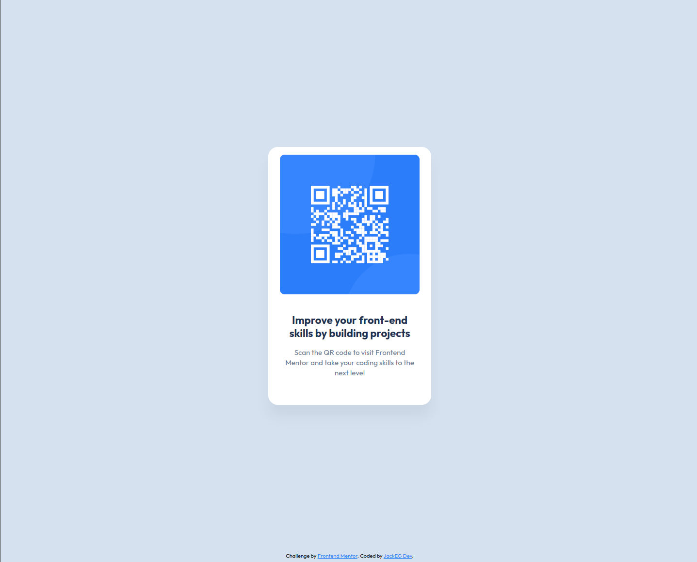

# Frontend Mentor - QR code component solution

This is a solution to the [QR code component challenge on Frontend Mentor](https://www.frontendmentor.io/challenges/qr-code-component-iux_sIO_H). Frontend Mentor challenges help you improve your coding skills by building realistic projects.

## Table of contents

- [Overview](#overview)
  - [Screenshot](#screenshot)
  - [Links](#links)
- [My process](#my-process)
  - [Built with](#built-with)
  - [What I learned](#what-i-learned)
  - [Continued development](#continued-development)
  - [Useful resources](#useful-resources)
- [Author](#author)
- [Acknowledgments](#acknowledgments)

## Overview

### Screenshot

### Links

- Solution URL: [Add solution URL here](https://github.com/Yakub357/qr-code-card)
- Live Site URL: [Add live site URL here](https://yakub357.github.io/qr-code-card/)

## My process

### Built with

- Semantic HTML5 markup
- CSS custom properties
- Flexbox
- CSS Grid
- CSS Animation
- Desktop-first workflow
- Node.js and Express JS for making a server to run the app on the backend.

### What I learned

I learned to make a good layout using plain CSS, flexbox and grids. Also implemented node.js application, where via express library set up the server.
Responsiveness: there was no need for adding more code @media queries to make the project mobile friendly. Because existing design itself mobile friendly.
Also implemented native CSS nesting property, eliminating the need to use third-party libraries.

### Continued development

I would introduce QR generation logic here, for example, app creates on the server QR-code for website or any other link, and generates the picture and send to the client the png QR-code together with CSS.

### Useful resources

At that time I mainly used Google Gemini AI generator. It helped with complex complexes. However, Page Styling and Semantics are done by me.

## Author

- Git Hub Profile - [@JackEG Dev](https://github.com/Yakub357)
- Frontend Mentor - [@JackEG](https://www.frontendmentor.io/profile/Yakub357)

## Acknowledgments

Thank you for Frontend Mentor for building such a well organized platform to practice Web Development Skills
